<h1> **3주차: Vue.js 기초**</h1>

Vue.js 소개 및 설치  
Vue CLI를 이용한 프로젝트 생성  
Vue 인스턴스, 데이터 바인딩  
컴포넌트, 템플릿  
디렉티브 (v-if, v-for, v-bind 등)  
실습: 간단한 Vue.js 애플리케이션 작성  


<h2> Vue.js 소개 및 설치 </h2>  

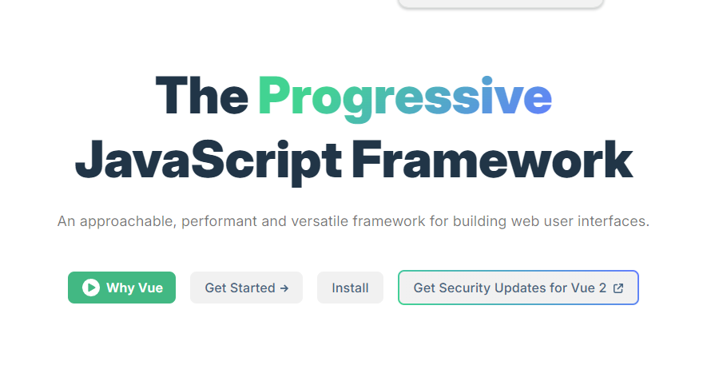

>>웹 사용자 인터페이스를 구축하기 위한 접근성, 성능, 다재다능함을 겸비한 프레임워크입니다.  


>>Vue(발음은 /vjuː/, view 와 유사 )는 사용자 인터페이스를 구축하기    
>>위한 JavaScript 프레임워크입니다. 표준 HTML, CSS, JavaScript를  
>>기반으로 구축되며, 모든 복잡성의 사용자 인터페이스를 효율적으로   
>>개발하는 데 도움이 되는 선언적 구성 요소 기반 프로그래밍 모델을
>>제공합니다.


>>단일 파일 구성 요소​
대부분의 빌드 도구 사용 Vue 프로젝트에서 우리는 Single-File Component*.vue ( 파일 이라고도 하며 SFC 로 약칭 )라는 HTML과 유사한 파일 형식을 사용하여 Vue 구성 요소를 작성합니다. 이름에서 알 수 있듯이 Vue SFC는 구성 요소의 로직(JavaScript), 템플릿(HTML), 스타일(CSS)을 단일 파일에 캡슐화합니다. 다음은 SFC 형식으로 작성된 이전 예입니다.  
  

```
// 스크립트 구문
<script setup>
import { ref } from 'vue'
const count = ref(0)
</script>

// 보여지는 웹HTML 부분
<template>
  <button @click="count++">Count is: {{ count }}</button>
</template>

// CSS 스타일 구조를 보여주는 구문
<style scoped>
button {
  font-weight: bold;
}
</style>
```

<h3>설치</h3>  

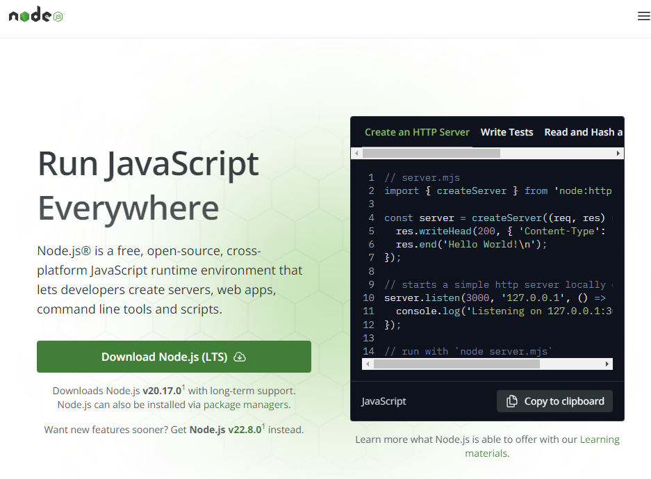  

다운로드 Node.js. 다운로드 및 설치를 한다.  

[node js 다운로드 ] (https://nodejs.org/en).


설치를하고 CMD 창에서 node 를 치면  

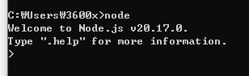    

다음과 같이 노드에접속을 할수 있다.
이제 VUE를 설치를 해보자.

<h3>Vue 설치하기</h3>

```
npm install -g @vue/cli
// 인스톨

npm update -g @vue/cli
// 업데이트
```  

npm 이란?  
npm은 Node Packaged Manager의 약자입니다.  
말그대로 패캐지를 관리를 해주는 프로그램 입니다.


<h2> Vue CLI를 이용한 프로젝트 생성</h2>      

```  
vue create hello-world  

// 다음과같은 cmd 창에서 명령어를 확인한다.

```  
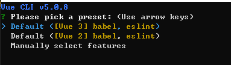

vue 2개 설치가 되어서 2개가 보인다.
vue3 을 선택을한다.

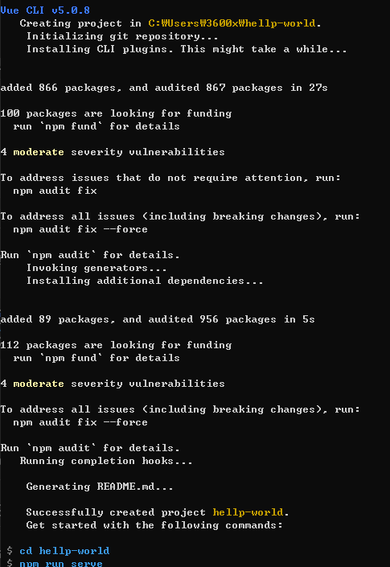

다음과 같은 설치가 완료되어서
맨마지막은 cd heellp-world  
폴더를 확인하고 이동을 한다.
npm run serve -> 실행시

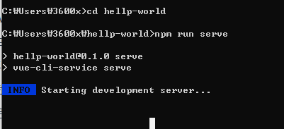

정상적으로 주소를 볼수 있다.


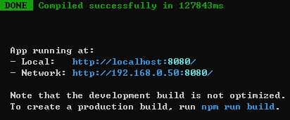

브라우져 창에서 확인가능하다.
 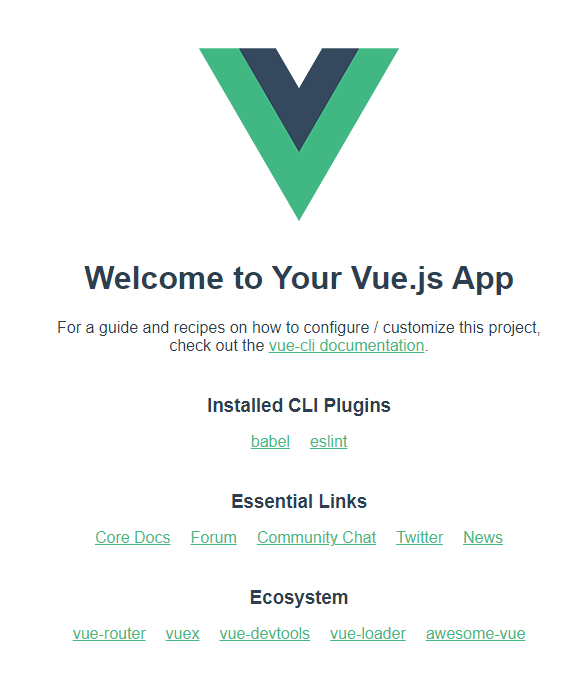


<h2> Vue 인스턴스, 데이터 바인딩</h2>    
  


<h3>Vue 인스턴스 </h3>

모든 Vue 앱은 Vue 함수로 새 Vue 인스턴스를 만드는 것부터 시작합니다.

```
  <div id="app">
    {{ message }}
  </div>

  <script>
    // Vue 3 애플리케이션 생성
    const { createApp } = Vue;

    // 애플리케이션 인스턴스 생성 및 마운트
    createApp({
      data() {
        return {
          message: 'Hello Vue 3!'
        };
      }
    }).mount('#app');
  </script>
```

createApp(): Vue 3에서는 애플리케이션을 생성할 때 createApp() 함수를 사용합니다.

data(): Vue 3에서 data는 함수로 반환되어야 하며, 객체를 반환하는 구조로 작성합니다.  

mount(): mount()는 Vue 애플리케이션을 특정 DOM 요소에 마운트하는 함수입니다.  
         여기서는 id="app"을 가진 엘리먼트에 마운트됩니다.  

Vue 3를 사용하여 기본적인 Vue 애플리케이션을 만들고, {{ message }}를 통해 데이터가 HTML에 바인딩되는 방식으로 작동합니다.  


---
<h3>데이터 바인딩</h3>

데이터 바인딩을 하기위한 기본 약속  

```
v-bind:속성명="데이터 혹은 함수"
      :속성명="데이터 혹은 함수"


<div id="vue">
    <input v-bind:value="name">
</div>

<div id="vue">
     <input :value="name">
</div>
```

```  
<script >
// 데이터 바인딩
export default {
  name : 'App',
  data(){
    return{
      title: "노랑",
      year : 2019,
      category : "액션, 드라마",
      textRed : "color: red",

    }
  }
}
</script>

<template>
  영화정보
  <div>
    <h3 class="bg-yellow" :style="textRed">{{ title }}</h3>
    <p>개봉:{{year}}</p>
    <p>장르:{{category}}</p>
  </div>
</template>


<style scoped>
//스타일 클래스
.bg-yellow {
  background-color: gold;
  padding: 10px;
}

</style>
```


<h2> 컴포넌트, 템플릿</h2>    

<h3>컴포넌트</h3>  

Vue.js에서 컴포넌트는 재사용 가능한 UI 블록으로, 애플리케이션의 특정 기능이나 화면을 정의하는 독립적인 단위입니다.

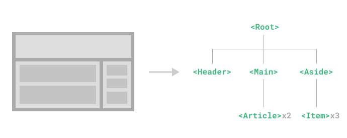  

컴포넌트 정의

템플릿: HTML을 사용하여 컴포넌트의 UI를 정의합니다. 

```
<template>
  <div>
    <h1>{{ title }}</h1>
  </div>
</template>
```

스크립트: 컴포넌트의 로직과 데이터, 메서드를 정의합니다.
```
<script>
export default {
  data() {
    return {
      title: 'Hello, Vue!'
    };
  },
  methods: {
    // 메서드 정의
  }
};
</script>

```
스타일: CSS를 사용하여 컴포넌트의 스타일을 정의합니다. 
```
<template>
  <div>
    <my-component></my-component>
  </div>
</template>

<script>
import MyComponent from './MyComponent.vue';

export default {
  components: {
    MyComponent
  }
};
</script>

```

컴포넌트 사용 예
컴포넌트를 사용하여 다른 컴포넌트를 포함할 수 있습니다.

```
<template>
  <div>
    <my-component></my-component>
  </div>
</template>

<script>
import MyComponent from './MyComponent.vue';

export default {
  components: {
    MyComponent
  }
};
</script>
```


---  


<h3>템플릿</h3>
템플릿은 Vue.js와 같은 프론트엔드 프레임워크에서 UI를 구성하는 구조를 정의하는 HTML 기반의 코드 조각입니다.  
Vue에서의 템플릿은 데이터와 UI를 연결하여, 데이터가 변경될 때 자동으로 UI가 업데이트되도록 하는 역할을 합니다.

  
<h4>텍스트 보간법</h4>  

데이터 바인딩의 가장 기본적인 형태는 "Mustache"(이중 중괄호) 문법을 사용한 텍스트 보간법입니다.
  

이중 중괄호 태그 내 msg는 해당 컴포넌트 인스턴스의 msg 속성의 값으로 대체됩니다. 또한 msg 속성이 변경될 때마다 업데이트됩니다.

```
<template>
  <div>
    <p>{{ message }}</p>
  </div>
</template>
```
<h4>HTML 출력</h4>  
이중 중괄호는 데이터를 HTML이 아닌 일반 텍스트로 해석합니다. 실제 HTML을 출력하려면 v-html 디렉티브을 사용해야 합니다:


```
<template>
  <div v-html="htmlContent"></div>
</template>

```

여기서 htmlContent는 HTML 태그가 포함된 문자열일 수 있으며, 이를 안전하게 출력합니다.  
하지만, 사용 시 XSS 공격에 주의해야 합니다.  

```
XSS(크로스 사이트 스크립팅) 공격은 악의적인 사용자가 웹 애플리케이션에
악성 스크립트를 주입하여 다른 사용자에게 전송하는 공격 방식입니다.
이 공격은 주로 사용자 입력을 검증하지 않거나 필터링하지 않는 취약점을 악용합니다.
```


---  

<h4>속성 바인딩</h4>  

속성 바인딩은 v-bind 디렉티브를 사용하여 HTML 요소의 속성에 Vue 인스턴스의 데이터를 동적으로 바인딩하는 방법입니다.

```
<template>
  
</template>

```
여기서 imageSrc는 Vue 인스턴스의 데이터 속성으로, 이미지 URL이 저장되어 있습니다.  
v-bind:를 생략하고 :를 사용할 수도 있습니다.

```

```


---
<h2> 디렉티브 (v-if, v-for, v-bind 등)</h2>    

Vue.js에서 디렉티브는 특수 속성으로, HTML 요소에 대한 행동이나 특성을 제어하는 데 사용됩니다.   

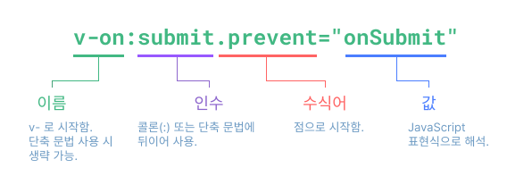

  
디렉티브(directives) : v- 접두사가 있는 특수 속성으로 디렉티브의 값(value)이 변경될 때 특정 효과를 반응적으로 DOM에 적용하는 것을 말한다. 
```
문서 객체 모델(The Document Object Model, 이하 DOM) 은 HTML, XML 문서의 프로그래밍 interface 이다.

DOM 은 프로그래밍 언어와 독립적으로 디자인되었다. 때문에 문서의 구조적인 표현은 단일 API 를 통해 이용가능하다.
``` 

전달인자(Argument) : 일부 디렉티브는 디렉티브명 뒤에 콜론(:)으로 표기되는 전달인자를 가질 수 있다. 예를 들어, v-bind 디렉티브는 반응적으로 HTML 속성을 갱신하는 데 사용한다.    

```
<a v-bind:href="url"> ... </a>

<!-- 단축 문법 -->
<a :href="url"> ... </a>
```

수식어(Modifiers) : 수식어는 점(.)으로 표시되는 특수 접미사로 디렉티브가 특별한 방식으로 바인딩되어야 함을 나타낸다.
```
<form @submit.prevent="onSubmit">...</form>
```

---  

v-text : string
텍스트 컨텐츠 업데이트
```
<template>
  <div>
    <h1>v-text 예제</h1>
    <span v-text="msg"></span>
    <br>
    <span>{{ msg }}</span>
    <br>
    <input v-model="msg" placeholder="메시지 입력">
  </div>
</template>

<script>
export default {
  data() {
    return {
      msg: '안녕하세요, Vue.js!'
    };
  }
};
</script>

<style scoped>
/* 스타일을 여기에 추가하세요 */
body {
    font-family: Arial, sans-serif;
    text-align: center;
    margin-top: 50px;
}
</style>
```
  

---  

v-html : string  
innerHTML을 업데이트합니다.
엘리먼트의 innerHTML을 업데이트합니다.
(특징 )
```
<div v-html="html"></div>
```  
보안 참고 사항
웹사이트에서 임의의 HTML을 동적으로 렌더링하는 것은 XSS 공격으로 쉽게 이어질 수 있기 때문에 매우 위험할 수 있습니다. 신뢰할 수 있는 컨텐츠에만 v-html을 사용하고, 사용자가 제공하는 컨텐츠에는 절대 사용하면 안됩니다.

  


---  

v-show : any
```
<template>
  <div>
    <h1>v-html 및 v-show 예제</h1>
    <button @click="toggleContent">내용 표시/숨기기</button>
    <div v-show="isVisible">
      <div v-html="htmlContent"></div>
    </div>
    <input v-model="htmlContent" placeholder="HTML 입력">
  </div>
</template>

<script>
export default {
  data() {
    return {
      htmlContent: '<p>안녕하세요, <span class="highlight">Vue.js!</span></p>',
      isVisible: true, // 요소의 가시성 상태
    };
  },
  methods: {
    toggleContent() {
      this.isVisible = !this.isVisible; // 상태 토글
    }
  }
};
</script>

<style scoped>
.highlight {
    color: red;
    font-weight: bold;
}
</style>
```
차이점은 v-show가 있는 엘리먼트는 항상 렌더링되고 DOM에 남아 있다는 것입니다. v-show는 엘리먼트의 display CSS 속성만 전환합니다.


v-show는 `<template>` 엘리먼트를 지원하지 않으며 v-else와 상호작용하지 않습니다.
(엘리먼트는 CSS 기반으로 전환 되므로, 초기 조건과 관계없이 항상 렌더링 됩니다.  
)

  


---
v-if : any  

v-if 디렉티브는 조건부로 블록을 렌더링하는 데 사용됩니다. 블록은 디렉티브 표현식이 truthy 값을 반환하는 경우에만 렌더링됩니다.
```
<h1 v-if="awesome">Vue는 정말 멋지죠!</h1>
```
  
--- 

v-else
```
<button @click="awesome = !awesome">전환</button>

<h1 v-if="awesome">Vue는 정말 멋지죠!</h1>
<h1 v-else>아닌가요? 😢</h1>
```
  
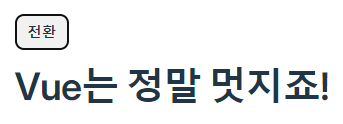  
--- 
v-else-if  
v-else-if는 이름에서 알 수 있듯이 v-if에 대한 "else if 블록" 역할을 합니다. 여러 번 연결될 수도 있습니다:
```
<div v-if="type === 'A'">
  A
</div>
<div v-else-if="type === 'B'">
  B
</div>
<div v-else-if="type === 'C'">
  C
</div>
<div v-else>
  A/B/C 아님
</div>
```
---  

v-for  
v-for 디렉티브를 사용하여 배열을 리스트로 렌더링할 수 있습니다. v-for 디렉티브는 item in items 형식의 특별한 문법이 필요합니다. 여기서 items는 배열이고, item(이하 아이템)은 배열 내 반복되는 앨리먼트의 `**별칭(alias)**`입니다.

```
const items = ref([{ message: 'Foo' }, { message: 'Bar' }])
``` 

```
<li v-for="item in items">
  {{ item.message }}
</li>
```  
v-for 범위 내 템플릿 표현식은 모든 상위 범위 속성에 접근할 수 있습니다. 또한 v-for는 현재 아이템의 인덱스를 가리키는 선택적 두 번째 별칭도 지원합니다.

```
const parentMessage = ref('Parent')
const items = ref([{ message: 'Foo' }, { message: 'Bar' }])
```
```
<li v-for="(item, index) in items">
  {{ parentMessage }} - {{ index }} - {{ item.message }}
</li>
```
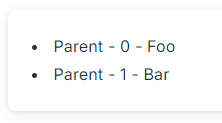

---  

v-on
v-on은 이벤트 리스너를 등록할 때 사용됩니다. DOM 이벤트에 대한 핸들러를 연결할 수 있습니다.


```
<script setup>
import { ref } from 'vue'

const count = ref(0)
</script>

<template>
  <button @click="count++">1 추가</button>
  <p>숫자 값은: {{ count }}</p>
</template>
```  
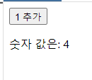


---  

v-bind  

v-bind는 HTML 요소의 속성에 데이터를 바인딩할 때 사용됩니다. 이를 통해 속성을 동적으로 변경할 수 있습니다.  


```  
<template>
  <div>
    <h1>속성 바인딩 예제</h1>
    
    <input v-model="imageSrc" placeholder="이미지 URL 입력">
  </div>
</template>

<script>
export default {
  data() {
    return {
      imageSrc: 'https://via.placeholder.com/300'
    };
  }
};
</script>

<style scoped>
img {
  max-width: 300px;
  border: 2px solid #ccc;
}
</style>

```


위 예에서는 imageSrc의 값이 이미지의 src 속성으로 바인딩됩니다.  
페이지에서 주소를 넣으면 바로바로 바뀝니다.


---


<h2> 실습: 간단한 Vue.js 애플리케이션 작성</h2>  


  
  
<h2>퍼미션 에러</h2>  

<h2>$ net stop winnat / net start winnat </h2>
