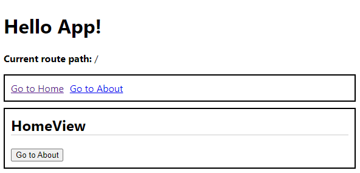
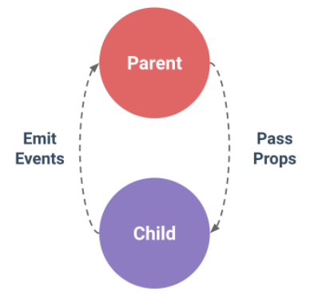
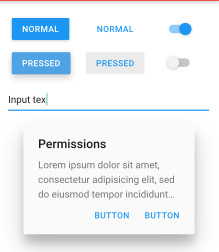
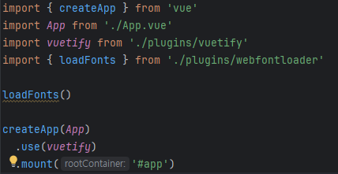
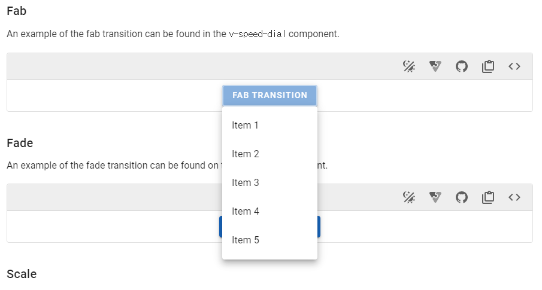
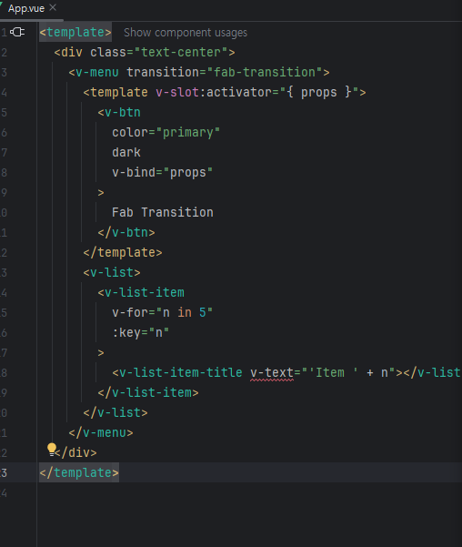
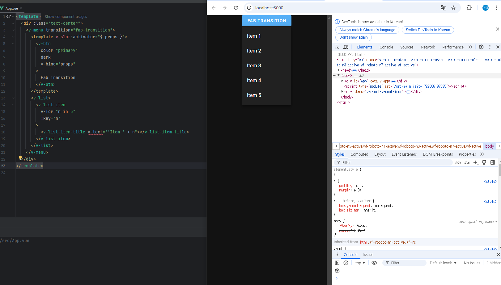
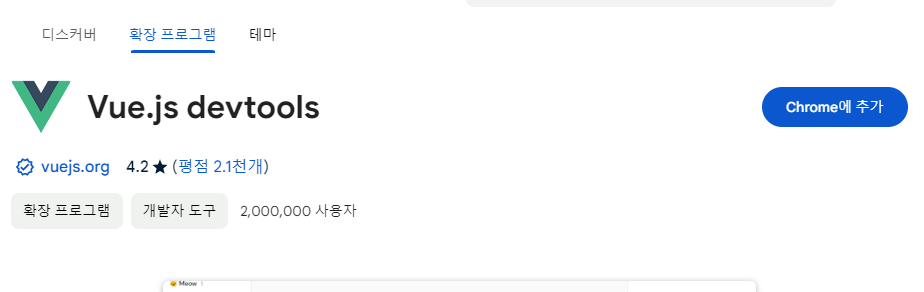
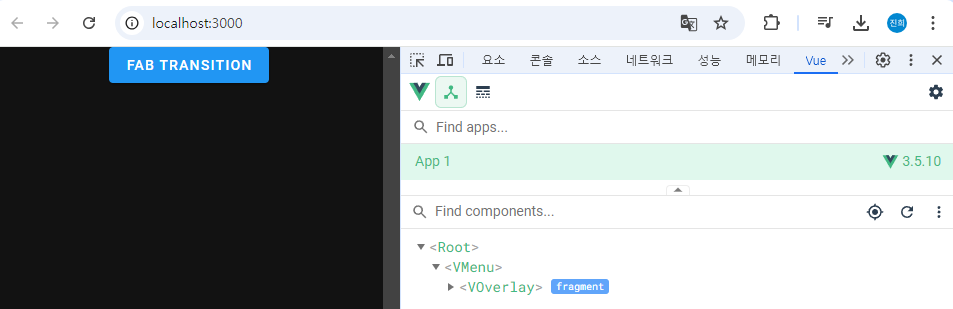
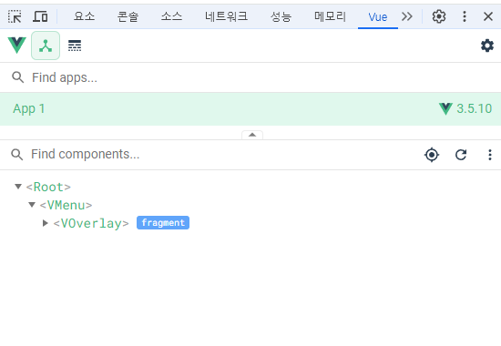

<h1> **4주차:Vue.js 심화**</h1>

- Vue Router를 이용한 SPA 개발
- Vuex를 이용한 상태 관리
- Vuetify/Element UI 등 UI 프레임워크 활용
- Vue.js 개발 도구 (Vue Devtools)
- 실습: Vue.js 애플리케이션 기능 확장


<h2>Vue Router를 이용한 SPA 개발</h2>

<h3>Vue Router 란?</h3>
웹페이지를 이동하는 방법    
  

- 페이지를 이동할때 서버에 요청하여 새로 갱신하는 것이 아니라 미리 해당 페이지를 받아 놓고 
  페이지 이동시 클라이언트의 라우팅을 이용하여 화면을 갱신함, 이러한 방식을   
  SPA라고도 함(Single Page Application)

 - 라우팅을 이용하면 화면간의 전환을 매끄럽게 할 수 있음

 - 뷰,리액트,앵귤러 모두 라우팅을 이용하여 화면을 전환함.

```
<router-link to="URL값"> 

페이지 이동 태그, 화면에선 <a> 태그로 치환됨

<router-view>
페이지 표시 태그 , 변경된 URL에 따라 해당 컴포넌트를 뿌려주는 영역

``` 



설치방법
```
npm install vue-router@4
```


<h3>Vuex를 이용한 상태 관리</h3>

<h2></h2>  

Vuex는 Vue.js 애플리케이션에 대한 상태 관리 패턴 + 라이브러리 입니다.  
애플리케이션의 모든 컴포넌트에 대한 중앙 집중식 저장소 역할을 하며 예측 가능한 방식으로 상태를  
변경할 수 있습니다. 또한 Vue의 공식 devtools 확장 프로그램 (opens new window)과 통합되어  
설정 시간이 필요 없는 디버깅 및 상태 스냅 샷 내보내기/가져오기와 같은 고급 기능을 제공합니다  

설치방법  

```
npm install vuex
```  

Vuex 패턴   


```


new Vue({
  // state 상태값
  data() {
    return {
      counter: 0
    };
  },
  // view 화면에 보이는 데이터
  template: `
    <div>{{ counter }}</div>
  `,
  // actions 행동
  methods: {
    increment() {
      this.counter++;
    }
  }
});
```

부모   

상태를 나타내는 값    
상태를 저장하는 값  

아이   
상태를 나타태는 값
상태를 저장하는 값
(부모로 부터 받음)

손자  
상태를 나타내는 값  
상태를 저장하는 값
(아이 -> 부모 를 걸쳐 데이터를 받아야한다.)  

상태값을 부모로부터 받은 아이는
상태값을 보려면 부모로 부터 데이터를 받아야 하는데

아이의 아이가(손자) 가 나타나면



부모  뷰->  
아이  뷰-> 액션 -> state 가족 이라는 공동체 Veux  
손자  뷰->  


<h3>Vuetify/Element UI 등 UI 프레임워크 활용</h3>  

vue 에서 사용할 수 있는 UI 라이브러리라고 할 수 있다.

Vuetify :빛에 따른 종이의 그림자 효과를 이용하여 입체감을 살리는 디자인 방식을 말한다.  


```
//설치방법
npm create vuetify@latest
```
Vuetify 설치후 
Vuetify 를 임포트(import)하고 Vue에게   
Vuetify를 사용하도록 지시해야합니다.

```
프로젝트를 생성후
vue add vuetify
명령어를 통해서 설치 완료.
```



만들어져 있는 환경에 있는 소스를 가지고 와서
붙여넣기 만으로 간단하게 메뉴나 환경을 구성을 할수 있다
원하는 메뉴를 선택을해서

붙여넣기를 하면

손쉽게 완성
  


  

```  
기타 설정(설치)
npm install sass sass-loader --save-dev
npm cache clean --force
```

Element UI : 

```
# NPM
$ npm install element-plus --save
```

파일 첨부  
```
// main.js
import { createApp } from 'vue'

import ElementPlus from 'element-plus'
import 'element-plus/dist/index.css'

import App from './App.vue'

const app = createApp(App)

app.use(ElementPlus)

app.mount('#app')  


// tsconfig.json
{
  "compilerOptions": {
    // ...
    "types": ["element-plus/global"]
  }
}
```


<h3>Vue.js 개발 도구 (Vue Devtools)</h3>
설치방법   



사용법
  

  

  

  

```
<template>
  <div class="text-center">
    <v-menu transition="fab-transition">
      <template v-slot:activator="{ props }">
        <v-btn
          color="primary"
          dark
          v-bind="props"
        >
          Fab Transition
        </v-btn>
      </template>
      <v-list>
        <v-list-item
          v-for="n in 5"
          :key="n"
        >
          <v-list-item-title v-text="'Item ' + n"></v-list-item-title>
        </v-list-item>
      </v-list>
    </v-menu>
  </div>
</template>
```
<h3>실습: Vue.js 애플리케이션 기능 확장</h3>

