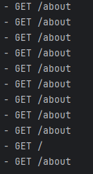

## 1. Express 미들웨어와 라우팅 (TypeScript 기반)

Express.js는 Node.js를 위한 웹 애플리케이션 프레임워크입니다.

### 미들웨어란?

미들웨어는 요청(request)과 응답(response) 사이에서 동작하는 함수입니다. 로깅, 인증, 에러 처리 등의 작업을 수행합니다.

### 라우팅이란?

라우팅은 클라이언트의 요청 URL에 따라 적절한 핸들러 함수로 연결해주는 메커니즘입니다.

### 예제 코드

```typescript
import express from 'express';
import type { Request, Response, NextFunction } from 'express';

const app = express();

// 미들웨어 예제
const logger = (req: Request, res: Response, next: NextFunction) => {
    console.log(`${new Date().toISOString()} - ${req.method} ${req.url}`);
    next();
};

// 모든 라우트에 미들웨어 적용
app.use(logger);

// 추가 미들웨어 예제
app.use((req: Request, res: Response, next: NextFunction) => {
    console.log('이 로그는 모든 요청에 대해 출력됩니다.');
    next();
});

// 특정 경로에만 미들웨어 적용
app.use('/about', (req: Request, res: Response, next: NextFunction) => {
    console.log('About 페이지에 접근했습니다.');
    next();
});

// 라우팅 예제
app.get('/', (req: Request, res: Response) => {
    res.send('홈페이지입니다!');
});

app.get('/about', (req: Request, res: Response) => {
    res.send('소개 페이지입니다!');
});

// 에러 처리 미들웨어
app.use((err: Error, req: Request, res: Response, next: NextFunction) => {
    console.error(err.stack);
    res.status(500).send('서버 에러가 발생했습니다!');
});

app.listen(3000, () => {
    console.log('서버가 3000번 포트에서 실행 중입니다.');
});
```

이 예제에서는 간단한 로깅 미들웨어를 만들고, 두 개의 라우트('/'와 '/about')를 정의합니다. 또한 에러 처리 미들웨어를 추가하여 서버 에러를 처리합니다. 
  

  


