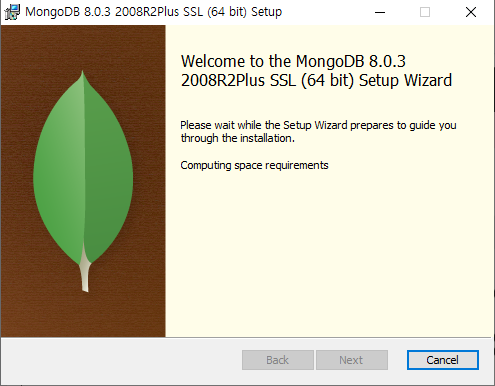
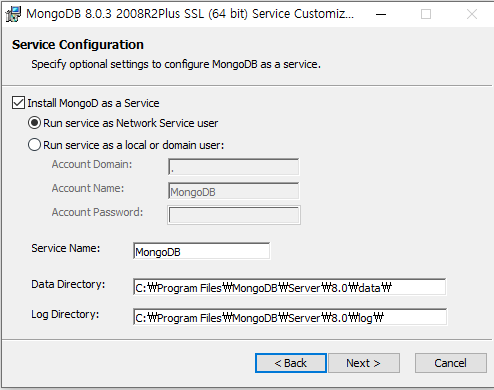

## 2. MongoDB 연동 (Mongoose ODM with TypeScript)

MongoDB는 인기 있는 NoSQL 데이터베이스이며, Mongoose는 MongoDB를 위한 ODM(Object Data Modeling) 라이브러리입니다. 

NoSQL은 비관계형 데이터베이스를 지칭하는 용어입니다. 주요 특징과 장단점은 다음과 같습니다:

## NoSQL의 특징

1. 비관계형 구조: 관계형 데이터베이스와 달리 데이터 간의 관계를 정의하지 않습니다

2. 유연한 스키마: 고정된 테이블 스키마가 없어 유동적인 데이터 구조를 가집니다

3. 대용량 데이터 처리: 대규모 데이터를 효과적으로 저장하고 처리할 수 있습니다

4. 분산 구조: 여러 서버에 데이터를 분산 저장하여 안정성을 높입니다

5. 수평적 확장성: 서버를 추가하여 쉽게 확장할 수 있습니다

## NoSQL의 장점

1. 유연한 데이터 모델: 구조화되지 않은 데이터를 쉽게 처리할 수 있습니다

2. 높은 확장성: 대용량 데이터와 높은 트래픽을 효과적으로 처리할 수 있습니다

3. 빠른 쿼리 처리: 특정 유형의 쿼리에 대해 빠른 성능을 제공합니다

4. 개발 속도 향상: 스키마 변경이 쉬워 빠른 개발이 가능합니다

## NoSQL의 단점

1. 데이터 일관성: 완벽한 데이터 일관성을 보장하기 어려울 수 있습니다

2. 복잡한 쿼리 처리: 복잡한 조인 연산 등이 어려울 수 있습니다

3. 표준화 부족: 데이터베이스 간 표준화된 인터페이스가 부족합니다

## NoSQL의 주요 사용 사례

1. 소셜 미디어 플랫폼: 대량의 비정형 데이터 처리에 적합합니다

2. 사물인터넷(IoT): 실시간으로 생성되는 대량의 센서 데이터 처리에 유용합니다

3. 전자상거래: 제품 정보, 고객 주문, 재고 관리 등에 활용됩니다

4. 모바일 애플리케이션: 다양한 형식의 데이터를 유연하게 처리할 수 있습니다

5. 실시간 분석: 대규모 데이터의 실시간 처리와 분석에 적합합니다
NoSQL은 대용량 데이터 처리, 유연한 데이터 모델, 높은 확장성이 필요한 현대적인 애플리케이션에서 널리 사용되고 있습니다.


### MongoDB 설치  
    
    
    
  

### Mongoose 설치 및 연결

먼저 필요한 패키지를 설치합니다:

```bash
npm install mongoose @types/mongoose
```

그리고 MongoDB에 연결합니다:

```typescript
import mongoose from 'mongoose';

// MongoDB 연결
mongoose.connect('mongodb://127.0.0.1:27017/yourdbname');

// 연결 확인
const db = mongoose.connection;
db.on('error', console.error.bind(console, 'connection error:'));
db.once('open', function() {
    console.log("MongoDB에 연결되었습니다.");
});
```

### 스키마 및 모델 정의

TypeScript를 사용하여 인터페이스와 스키마를 정의합니다:

```typescript
// 사용자 인터페이스 정의
interface IUser {
    name: string;
    email: string;
    age: number;
}

// 사용자 스키마 정의
const UserSchema = new mongoose.Schema<IUser>({
    name: { type: String, required: true },
    email: { type: String, required: true, unique: true },
    age: { type: Number, min: 18, max: 100 }
});

// 모델 생성
const User = mongoose.model<IUser>('User', UserSchema);

```

### CRUD 작업 예제

```typescript
// CRUD 함수 정의
async function createUser(name: string, email: string, age: number) {
    const user = new User({ name, email, age });
    await user.save();
    console.log('사용자가 생성되었습니다:', user);
}

async function findUsers() {
    const users = await User.find();
    console.log('모든 사용자:', users);
}

async function updateUser(id: string, newAge: number) {
    const user = await User.findByIdAndUpdate(id, { age: newAge }, { new: true });
    console.log('업데이트된 사용자:', user);
}

async function deleteUser(id: string) {
    await User.findByIdAndDelete(id);
    console.log('사용자가 삭제되었습니다.');
}

// 함수 실행
async function run() {
    try {
        await createUser('홍길동', 'hong@example.com', 25);
        await findUsers();
        // 주의: 실제 ID를 사용해야 합니다.
        // await updateUser('실제사용자ID', 26);
        // await deleteUser('실제사용자ID');
    } catch (error) {
        console.error('에러 발생:', error);
    } finally {
        // 연결 종료
        await mongoose.disconnect();
    }
}

run();
```
실행시 다음과 같습니다.  


사용자 생성
createUser 함수가 성공적으로 실행되어 새로운 사용자가 데이터베이스에 추가되었음을 보여줍니다.
_id는 MongoDB가 자동으로 생성한 고유 식별자입니다.
__v는 Mongoose의 버전 키로, 문서의 버전을 나타냅니다.

사용자 조회
findUsers 함수가 실행되어 데이터베이스에 있는 모든 사용자를 조회한 결과입니다. 현재는 방금 생성한 사용자 한 명만 있습니다.

다음과같이 run() 을 변경해서 사용을 할수 있다.
```aiignore
async function run() {
    try {
        await createUser('홍길동', 'hong@example.com', 25); // 유저 생성
        await findUsers();
        await updateUser("6725751903fe4a15518c8227", 26); // 나이변경
        await findUsers(); // 업데이트 확인
        await deleteUser("6725751903fe4a15518c8227"); // 유저 삭제 등
        await findUsers(); // 삭제 확인
    } catch (error) {
        console.error('에러 발생:', error);
    } finally {
        await mongoose.disconnect();
    }
}

```
