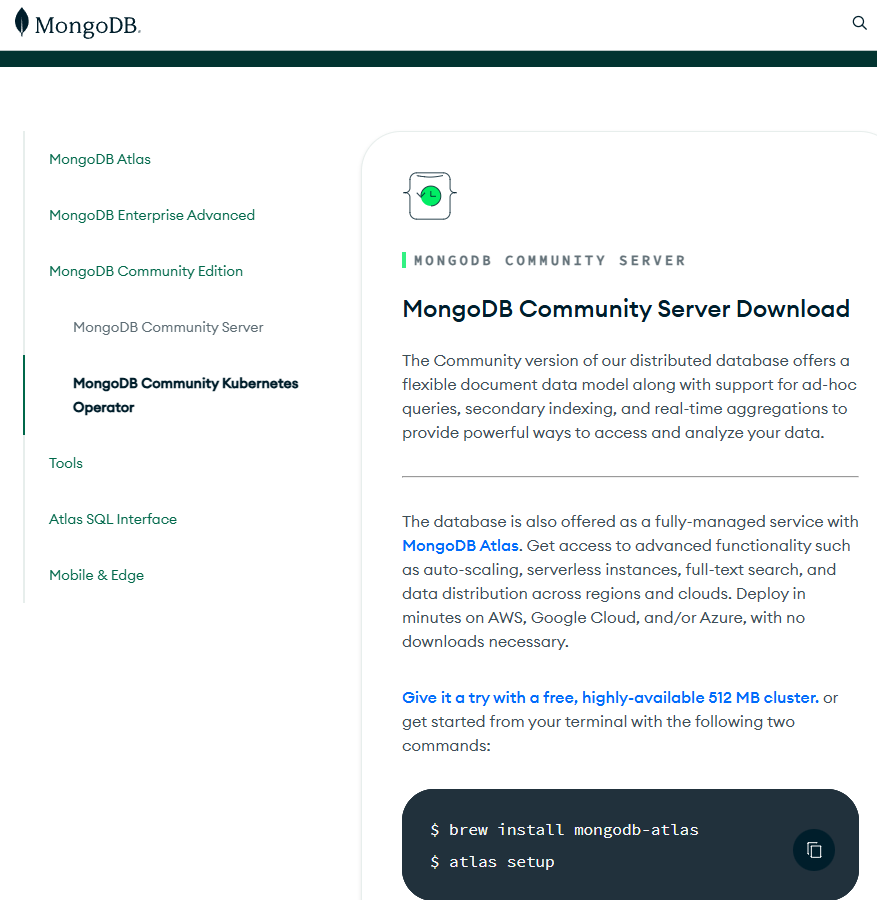
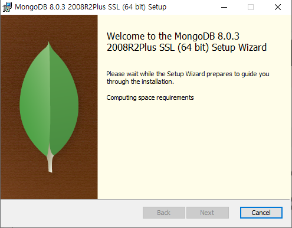
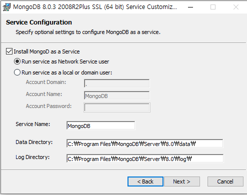
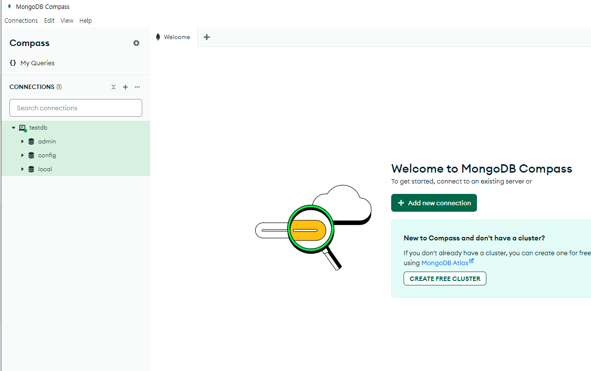
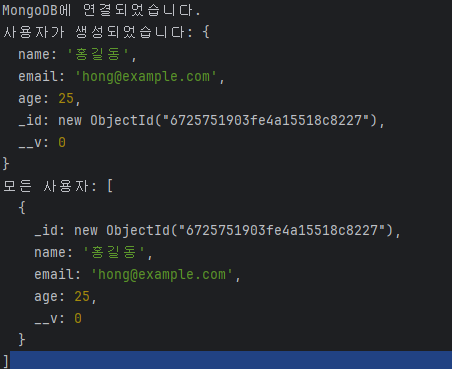

**6주차: Node.js 심화**

- Express 미들웨어, 라우팅
- MongoDB 연동 (Mongoose ODM)
- RESTful API 설계 및 구현
- 실습: Node.js/Express API 서버 작성


## 1. Express 미들웨어와 라우팅 (TypeScript 기반)

Express.js는 Node.js를 위한 웹 애플리케이션 프레임워크입니다.

### 미들웨어란?

미들웨어는 요청(request)과 응답(response) 사이에서 동작하는 함수입니다. 로깅, 인증, 에러 처리 등의 작업을 수행합니다.

### 라우팅이란?

라우팅은 클라이언트의 요청 URL에 따라 적절한 핸들러 함수로 연결해주는 메커니즘입니다.

### 예제 코드

```typescript
import express from 'express';
import type { Request, Response, NextFunction } from 'express';

const app = express();

// 미들웨어 예제
const logger = (req: Request, res: Response, next: NextFunction) => {
    console.log(`${new Date().toISOString()} - ${req.method} ${req.url}`);
    next();
};

// 모든 라우트에 미들웨어 적용
app.use(logger);

// 추가 미들웨어 예제
app.use((req: Request, res: Response, next: NextFunction) => {
    console.log('이 로그는 모든 요청에 대해 출력됩니다.');
    next();
});

// 특정 경로에만 미들웨어 적용
app.use('/about', (req: Request, res: Response, next: NextFunction) => {
    console.log('About 페이지에 접근했습니다.');
    next();
});

// 라우팅 예제
app.get('/', (req: Request, res: Response) => {
    res.send('홈페이지입니다!');
});

app.get('/about', (req: Request, res: Response) => {
    res.send('소개 페이지입니다!');
});

// 에러 처리 미들웨어
app.use((err: Error, req: Request, res: Response, next: NextFunction) => {
    console.error(err.stack);
    res.status(500).send('서버 에러가 발생했습니다!');
});

app.listen(3000, () => {
    console.log('서버가 3000번 포트에서 실행 중입니다.');
});
```

이 예제에서는 간단한 로깅 미들웨어를 만들고, 두 개의 라우트('/'와 '/about')를 정의합니다. 또한 에러 처리 미들웨어를 추가하여 서버 에러를 처리합니다. 
  

  


## 2. MongoDB 연동 (Mongoose ODM with TypeScript)

MongoDB는 인기 있는 NoSQL 데이터베이스이며, Mongoose는 MongoDB를 위한 ODM(Object Data Modeling) 라이브러리입니다. 

NoSQL은 비관계형 데이터베이스를 지칭하는 용어입니다. 주요 특징과 장단점은 다음과 같습니다:

## NoSQL의 특징

1. 비관계형 구조: 관계형 데이터베이스와 달리 데이터 간의 관계를 정의하지 않습니다

2. 유연한 스키마: 고정된 테이블 스키마가 없어 유동적인 데이터 구조를 가집니다

3. 대용량 데이터 처리: 대규모 데이터를 효과적으로 저장하고 처리할 수 있습니다

4. 분산 구조: 여러 서버에 데이터를 분산 저장하여 안정성을 높입니다

5. 수평적 확장성: 서버를 추가하여 쉽게 확장할 수 있습니다

## NoSQL의 장점

1. 유연한 데이터 모델: 구조화되지 않은 데이터를 쉽게 처리할 수 있습니다

2. 높은 확장성: 대용량 데이터와 높은 트래픽을 효과적으로 처리할 수 있습니다

3. 빠른 쿼리 처리: 특정 유형의 쿼리에 대해 빠른 성능을 제공합니다

4. 개발 속도 향상: 스키마 변경이 쉬워 빠른 개발이 가능합니다

## NoSQL의 단점

1. 데이터 일관성: 완벽한 데이터 일관성을 보장하기 어려울 수 있습니다

2. 복잡한 쿼리 처리: 복잡한 조인 연산 등이 어려울 수 있습니다

3. 표준화 부족: 데이터베이스 간 표준화된 인터페이스가 부족합니다

## NoSQL의 주요 사용 사례

1. 소셜 미디어 플랫폼: 대량의 비정형 데이터 처리에 적합합니다

2. 사물인터넷(IoT): 실시간으로 생성되는 대량의 센서 데이터 처리에 유용합니다

3. 전자상거래: 제품 정보, 고객 주문, 재고 관리 등에 활용됩니다

4. 모바일 애플리케이션: 다양한 형식의 데이터를 유연하게 처리할 수 있습니다

5. 실시간 분석: 대규모 데이터의 실시간 처리와 분석에 적합합니다
NoSQL은 대용량 데이터 처리, 유연한 데이터 모델, 높은 확장성이 필요한 현대적인 애플리케이션에서 널리 사용되고 있습니다.


### MongoDB 설치  
    
    
    
  

### Mongoose 설치 및 연결

먼저 필요한 패키지를 설치합니다:

```bash
npm install mongoose @types/mongoose
```

그리고 MongoDB에 연결합니다:

```typescript
import mongoose from 'mongoose';

// MongoDB 연결
mongoose.connect('mongodb://127.0.0.1:27017/yourdbname');

// 연결 확인
const db = mongoose.connection;
db.on('error', console.error.bind(console, 'connection error:'));
db.once('open', function() {
    console.log("MongoDB에 연결되었습니다.");
});
```

### 스키마 및 모델 정의

TypeScript를 사용하여 인터페이스와 스키마를 정의합니다:

```typescript
// 사용자 인터페이스 정의
interface IUser {
    name: string;
    email: string;
    age: number;
}

// 사용자 스키마 정의
const UserSchema = new mongoose.Schema<IUser>({
    name: { type: String, required: true },
    email: { type: String, required: true, unique: true },
    age: { type: Number, min: 18, max: 100 }
});

// 모델 생성
const User = mongoose.model<IUser>('User', UserSchema);

```

### CRUD 작업 예제

```typescript
// CRUD 함수 정의
async function createUser(name: string, email: string, age: number) {
    const user = new User({ name, email, age });
    await user.save();
    console.log('사용자가 생성되었습니다:', user);
}

async function findUsers() {
    const users = await User.find();
    console.log('모든 사용자:', users);
}

async function updateUser(id: string, newAge: number) {
    const user = await User.findByIdAndUpdate(id, { age: newAge }, { new: true });
    console.log('업데이트된 사용자:', user);
}

async function deleteUser(id: string) {
    await User.findByIdAndDelete(id);
    console.log('사용자가 삭제되었습니다.');
}

// 함수 실행
async function run() {
    try {
        await createUser('홍길동', 'hong@example.com', 25);
        await findUsers();
        // 주의: 실제 ID를 사용해야 합니다.
        // await updateUser('실제사용자ID', 26);
        // await deleteUser('실제사용자ID');
    } catch (error) {
        console.error('에러 발생:', error);
    } finally {
        // 연결 종료
        await mongoose.disconnect();
    }
}

run();
```
실행시 다음과 같습니다.  




사용자 생성
createUser 함수가 성공적으로 실행되어 새로운 사용자가 데이터베이스에 추가되었음을 보여줍니다.
_id는 MongoDB가 자동으로 생성한 고유 식별자입니다.
__v는 Mongoose의 버전 키로, 문서의 버전을 나타냅니다.

사용자 조회
findUsers 함수가 실행되어 데이터베이스에 있는 모든 사용자를 조회한 결과입니다. 현재는 방금 생성한 사용자 한 명만 있습니다.

다음과같이 run() 을 변경해서 사용을 할수 있다.
```aiignore
async function run() {
    try {
        await createUser('홍길동', 'hong@example.com', 25); // 유저 생성
        await findUsers();
        await updateUser("6725751903fe4a15518c8227", 26); // 나이변경
        await findUsers(); // 업데이트 확인
        await deleteUser("6725751903fe4a15518c8227"); // 유저 삭제 등
        await findUsers(); // 삭제 확인
    } catch (error) {
        console.error('에러 발생:', error);
    } finally {
        await mongoose.disconnect();
    }
}

```


## 3. RESTful API 설계 및 구현 (Express + TypeScript)

RESTful API는 웹 서비스를 설계하는 아키텍처 스타일입니다. Express와 TypeScript를 사용하여 RESTful API를 구현합니다.


## RESTful API란?

RESTful API는 웹에서 정보를 주고받는 방식을 정리한 규칙이라고 생각하면 됩니다. 쉽게 말해, 인터넷을 통해 데이터를 요청하고 받을 때 사용하는 약속입니다.

주요 특징:
1. 자원(리소스)을 URL로 표현합니다.
2. HTTP 메서드(GET, POST, PUT, DELETE 등)를 사용해 자원을 조작합니다.
3. 클라이언트와 서버가 서로 독립적으로 존재합니다.

## Express란?

Express는 Node.js를 위한 웹 애플리케이션 프레임워크입니다. 쉽게 말해, 웹 서버를 만들기 위한 도구 모음이라고 할 수 있습니다. Express를 사용하면 웹 서버를 쉽고 빠르게 만들 수 있습니다.

## TypeScript란?

TypeScript는 JavaScript에 타입을 추가한 프로그래밍 언어입니다. 코드를 작성할 때 실수를 줄이고, 더 안정적인 프로그램을 만들 수 있게 도와줍니다.

## Express와 TypeScript로 RESTful API 구현하기

이 말은 결국 "Express라는 도구와 TypeScript라는 언어를 사용해서, 웹에서 정보를 주고받는 규칙(RESTful API)을 따르는 웹 서버를 만든다"는 의미입니다.

예를 들어:
1. Express로 웹 서버의 기본 구조를 만듭니다.
2. TypeScript를 사용해 코드의 안정성을 높입니다.
3. RESTful API 규칙에 따라 URL과 HTTP 메서드를 설계합니다.


### API 설계

간단한 도서 관리 시스템을 위한 API를 설계합니다:

- GET /api/books: 모든 책 조회
- GET /api/books/:id: 특정 책 조회
- POST /api/books: 새 책 추가
- PUT /api/books/:id: 책 정보 수정
- DELETE /api/books/:id: 책 삭제

### 구현
네, 각 API 엔드포인트에 대한 설명과 함께 해당 코드를 제시하는 방식으로 설명할 수 있습니다. 다음과 같이 구성할 수 있습니다:

### RESTful API 설계 및 구현

도서 관리 시스템을 위한 RESTful API확인한다.

1. **모든 책 조회 (GET /api/books)**

   모든 책의 목록을 조회합니다.

   ```typescript
   router.get('/', async (req: Request, res: Response) => {
     try {
       const books = await Book.find();
       res.json(books);
     } catch (err) {
       res.status(500).json({ message: (err as Error).message });
     }
   });
   ```

2. **특정 책 조회 (GET /api/books/:id)**

   ID를 기반으로 특정 책의 정보를 조회합니다.

   ```typescript
   router.get('/:id', async (req: Request, res: Response) => {
     try {
       const book = await Book.findById(req.params.id);
       if (!book) return res.status(404).json({ message: '책을 찾을 수 없습니다.' });
       res.json(book);
     } catch (err) {
       res.status(500).json({ message: (err as Error).message });
     }
   });
   ```

3. **새 책 추가 (POST /api/books)**

   새로운 책을 데이터베이스에 추가합니다.

   ```typescript
   router.post('/', async (req: Request, res: Response) => {
     const book = new Book({
       title: req.body.title,
       author: req.body.author,
       publishedYear: req.body.publishedYear
     });
     try {
       const newBook = await book.save();
       res.status(201).json(newBook);
     } catch (err) {
       res.status(400).json({ message: (err as Error).message });
     }
   });
   ```

4. **책 정보 수정 (PUT /api/books/:id)**

   ID를 기반으로 특정 책의 정보를 수정합니다.

   ```typescript
   router.put('/:id', async (req: Request, res: Response) => {
     try {
       const book = await Book.findByIdAndUpdate(req.params.id, req.body, { new: true });
       if (!book) return res.status(404).json({ message: '책을 찾을 수 없습니다.' });
       res.json(book);
     } catch (err) {
       res.status(400).json({ message: (err as Error).message });
     }
   });
   ```

5. **책 삭제 (DELETE /api/books/:id)**

   ID를 기반으로 특정 책을 데이터베이스에서 삭제합니다.

   ```typescript
   router.delete('/:id', async (req: Request, res: Response) => {
     try {
       const book = await Book.findByIdAndDelete(req.params.id);
       if (!book) return res.status(404).json({ message: '책을 찾을 수 없습니다.' });
       res.json({ message: '책이 삭제되었습니다.' });
     } catch (err) {
       res.status(500).json({ message: (err as Error).message });
     }
   });
   ```  


### 하나의 소스로 정리 

```aiignore
import express, { Request, Response } from 'express';
import Book from '../models/Book';

const router = express.Router();

// 1. 모든 책 조회 (GET /api/books)
router.get('/', async (req: Request, res: Response) => {
  try {
    // 데이터베이스에서 모든 책을 조회합니다.
    const books = await Book.find();
    // 조회된 책 목록을 JSON 형태로 응답합니다.
    res.json(books);
  } catch (err) {
    // 오류 발생 시 500 상태 코드와 함께 오류 메시지를 응답합니다.
    res.status(500).json({ message: (err as Error).message });
  }
});

// 2. 특정 책 조회 (GET /api/books/:id)
router.get('/:id', async (req: Request, res: Response) => {
  try {
    // URL 파라미터에서 책 ID를 추출하여 해당 책을 조회합니다.
    const book = await Book.findById(req.params.id);
    if (!book) {
      // 책을 찾지 못한 경우 404 상태 코드와 함께 메시지를 응답합니다.
      return res.status(404).json({ message: '책을 찾을 수 없습니다.' });
    }
    // 찾은 책 정보를 JSON 형태로 응답합니다.
    res.json(book);
  } catch (err) {
    res.status(500).json({ message: (err as Error).message });
  }
});

// 3. 새 책 추가 (POST /api/books)
router.post('/', async (req: Request, res: Response) => {
  // 요청 본문에서 책 정보를 추출하여 새 Book 객체를 생성합니다.
  const book = new Book({
    title: req.body.title,
    author: req.body.author,
    publishedYear: req.body.publishedYear
  });
  try {
    // 새 책을 데이터베이스에 저장합니다.
    const newBook = await book.save();
    // 201 상태 코드(생성됨)와 함께 새로 생성된 책 정보를 응답합니다.
    res.status(201).json(newBook);
  } catch (err) {
    // 유효성 검사 실패 등의 오류 시 400 상태 코드와 함께 오류 메시지를 응답합니다.
    res.status(400).json({ message: (err as Error).message });
  }
});

// 4. 책 정보 수정 (PUT /api/books/:id)
router.put('/:id', async (req: Request, res: Response) => {
  try {
    // URL 파라미터의 ID로 책을 찾아 요청 본문의 정보로 업데이트합니다.
    const book = await Book.findByIdAndUpdate(req.params.id, req.body, { new: true });
    if (!book) {
      return res.status(404).json({ message: '책을 찾을 수 없습니다.' });
    }
    // 업데이트된 책 정보를 응답합니다.
    res.json(book);
  } catch (err) {
    res.status(400).json({ message: (err as Error).message });
  }
});

// 5. 책 삭제 (DELETE /api/books/:id)
router.delete('/:id', async (req: Request, res: Response) => {
  try {
    // URL 파라미터의 ID로 책을 찾아 삭제합니다.
    const book = await Book.findByIdAndDelete(req.params.id);
    if (!book) {
      return res.status(404).json({ message: '책을 찾을 수 없습니다.' });
    }
    // 삭제 성공 메시지를 응답합니다.
    res.json({ message: '책이 삭제되었습니다.' });
  } catch (err) {
    res.status(500).json({ message: (err as Error).message });
  }
});

export default router;

```

이러한 API 구현을 통해 클라이언트는 서버와 통신하여 도서 정보를 조회, 추가, 수정, 삭제할 수 있습니다. 각 엔드포인트는 HTTP 메서드(GET, POST, PUT, DELETE)를 사용하여 RESTful 원칙을 따르고 있으며, 적절한 상태 코드와 응답 메시지를 반환하여 클라이언트에게 작업 결과를 알려줍니다.

이 API 설계는 도서 관리 시스템의 기본적인 CRUD(Create, Read, Update, Delete) 기능을 모두 포함하고 있어, 클라이언트 애플리케이션에서 필요한 모든 도서 관련 작업을 수행할 수 있습니다.


## 4. 실습: Node.js/Express API 서버와 Vue 3 클라이언트 연동


## 실습: Node.js/Express API 서버 작성 및 Vue.js 프론트엔드 연동

### 프로젝트 구조

```
library-system/
├── backend/
│   ├── src/
│   │   ├── models/
│   │   │   └── Book.ts
│   │   ├── routes/
│   │   │   └── books.ts
│   │   └── index.ts
│   ├── package.json
│   └── tsconfig.json
├── frontend/
│   ├── public/
│   ├── src/
│   │   ├── components/
│   │   │   └── BookList.vue
│   │   ├── App.vue
│   │   └── main.ts
│   ├── package.json
│   └── tsconfig.json
└── README.md
```

### 백엔드 구현

1. 프로젝트 초기화:

```bash
mkdir library-system && cd library-system
mkdir backend && cd backend
npm init -y
npm install express mongoose cors
npm install --save-dev typescript @types/express @types/mongoose @types/cors ts-node nodemon
```

2. `backend/tsconfig.json` 파일 생성:

```json
{
  "compilerOptions": {
    "target": "es6",
    "module": "commonjs",
    "outDir": "./dist",
    "rootDir": "./src",
    "strict": true,
    "esModuleInterop": true
  },
  "include": ["src/**/*"]
}
```

3. `backend/src/models/Book.ts` 파일 생성:

```typescript
import mongoose, { Document, Schema } from 'mongoose';

export interface IBook extends Document {
  title: string;
  author: string;
  publishedYear: number;
}

const BookSchema: Schema = new Schema({
  title: { type: String, required: true },
  author: { type: String, required: true },
  publishedYear: { type: Number, required: true }
});

export default mongoose.model<IBook>('Book', BookSchema);
```

4. `backend/src/routes/books.ts` 파일 생성:

```typescript
import express, { Request, Response } from 'express';
import Book from '../models/Book';

const router = express.Router();

// GET /api/books
router.get('/', async (req: Request, res: Response) => {
  try {
    const books = await Book.find();
    res.json(books);
  } catch (err) {
    res.status(500).json({ message: (err as Error).message });
  }
});

// GET /api/books/:id
router.get('/:id', async (req: Request, res: Response) => {
  try {
    const book = await Book.findById(req.params.id);
    if (!book) return res.status(404).json({ message: '책을 찾을 수 없습니다.' });
    res.json(book);
  } catch (err) {
    res.status(500).json({ message: (err as Error).message });
  }
});

// POST /api/books
router.post('/', async (req: Request, res: Response) => {
  const book = new Book(req.body);
  try {
    const newBook = await book.save();
    res.status(201).json(newBook);
  } catch (err) {
    res.status(400).json({ message: (err as Error).message });
  }
});

// PUT /api/books/:id
router.put('/:id', async (req: Request, res: Response) => {
  try {
    const book = await Book.findByIdAndUpdate(req.params.id, req.body, { new: true });
    if (!book) return res.status(404).json({ message: '책을 찾을 수 없습니다.' });
    res.json(book);
  } catch (err) {
    res.status(400).json({ message: (err as Error).message });
  }
});

// DELETE /api/books/:id
router.delete('/:id', async (req: Request, res: Response) => {
  try {
    const book = await Book.findByIdAndDelete(req.params.id);
    if (!book) return res.status(404).json({ message: '책을 찾을 수 없습니다.' });
    res.json({ message: '책이 삭제되었습니다.' });
  } catch (err) {
    res.status(500).json({ message: (err as Error).message });
  }
});

export default router;
```

5. `backend/src/index.ts` 파일 생성:

```typescript
import express from 'express';
import mongoose from 'mongoose';
import cors from 'cors';
import bookRoutes from './routes/books';

const app = express();

app.use(cors());
app.use(express.json());

mongoose.connect('mongodb://localhost:27017/library')
  .then(() => console.log('Connected to MongoDB'))
  .catch(err => console.error('Could not connect to MongoDB', err));

app.use('/api/books', bookRoutes);

const PORT = process.env.PORT || 3000;
app.listen(PORT, () => console.log(`Server running on port ${PORT}`));
```

6. `backend/package.json`의 scripts 섹션 수정:

```json
"scripts": {
  "start": "ts-node src/index.ts",
  "dev": "nodemon --exec ts-node src/index.ts"
}
```

### 프론트엔드 구현

1. Vue.js 프로젝트 생성:

```bash
cd ..
npm init vue@latest frontend
cd frontend
npm install
npm install axios
```

2. `frontend/src/components/BookList.vue` 파일 생성:

```vue
<template>
  <div>
    <h2>도서 목록</h2>
    <ul>
      <li v-for="book in books" :key="book._id">
        {{ book.title }} - {{ book.author }} ({{ book.publishedYear }})
        <button @click="editBook(book)">수정</button>
        <button @click="deleteBook(book._id)">삭제</button>
      </li>
    </ul>

    <h3>{{ isEditing ? '책 수정' : '새 책 추가' }}</h3>
    <form @submit.prevent="isEditing ? updateBook() : addBook()">
      <input v-model="newBook.title" placeholder="제목" required>
      <input v-model="newBook.author" placeholder="저자" required>
      <input v-model.number="newBook.publishedYear" placeholder="출판년도" type="number" required>
      <button type="submit">{{ isEditing ? '수정' : '추가' }}</button>
      <button v-if="isEditing" @click="cancelEdit" type="button">취소</button>
    </form>
  </div>
</template>

<script lang="ts">
import { defineComponent, ref, onMounted } from 'vue';
import axios from 'axios';

interface Book {
  _id: string;
  title: string;
  author: string;
  publishedYear: number;
}

export default defineComponent({
  name: 'BookList',
  setup() {
    const books = ref<Book[]>([]);
    const newBook = ref<Partial<Book>>({ title: '', author: '', publishedYear: 0 });
    const isEditing = ref(false);

    const fetchBooks = async () => {
      try {
        const response = await axios.get<Book[]>('http://localhost:3000/api/books');
        books.value = response.data;
      } catch (error) {
        console.error('Error fetching books:', error);
      }
    };

    const addBook = async () => {
      try {
        await axios.post('http://localhost:3000/api/books', newBook.value);
        await fetchBooks();
        newBook.value = { title: '', author: '', publishedYear: 0 };
      } catch (error) {
        console.error('Error adding book:', error);
      }
    };

    const editBook = (book: Book) => {
      newBook.value = { ...book };
      isEditing.value = true;
    };

    const updateBook = async () => {
      try {
        await axios.put(`http://localhost:3000/api/books/${newBook.value._id}`, newBook.value);
        await fetchBooks();
        cancelEdit();
      } catch (error) {
        console.error('Error updating book:', error);
      }
    };

    const deleteBook = async (id: string) => {
      try {
        await axios.delete(`http://localhost:3000/api/books/${id}`);
        await fetchBooks();
      } catch (error) {
        console.error('Error deleting book:', error);
      }
    };

    const cancelEdit = () => {
      newBook.value = { title: '', author: '', publishedYear: 0 };
      isEditing.value = false;
    };

    onMounted(fetchBooks);

    return { 
      books, 
      newBook, 
      isEditing, 
      addBook, 
      editBook, 
      updateBook, 
      deleteBook, 
      cancelEdit 
    };
  },
});
</script>
```

3. `frontend/src/App.vue` 파일 수정:

```vue
<template>
  <div id="app">
    <h1>도서 관리 시스템</h1>
    <BookList />
  </div>
</template>

<script lang="ts">
import { defineComponent } from 'vue';
import BookList from './components/BookList.vue';

export default defineComponent({
  name: 'App',
  components: {
    BookList,
  },
});
</script>
```

### 실행 방법

1. 백엔드 실행:
   ```
   cd backend
   npm run dev
   ```

2. 프론트엔드 실행:
   ```
   cd frontend
   npm run dev
   ```

이제 백엔드 서버가 `http://localhost:3000`에서 실행되고, 프론트엔드 개발 서버가 `http://localhost:5173`(또는 다른 사용 가능한 포트)에서 실행됩니다.

브라우저에서 `http://localhost:5173`을 열면 도서 관리 시스템의 UI를 볼 수 있으며, 책을 추가, 수정, 삭제, 조회할 수 있습니다.

이 실습을 통해 Node.js와 Express를 사용한 RESTful API 서버 구현, MongoDB를 사용한 데이터 저장, 그리고 Vue.js를 사용한 프론트엔드 개발의 기본적인 과정을 경험할 수 있습니다. 또한 TypeScript를 사용하여 타입 안정성을 확보하고, 백엔드와 프론트엔드 간의 데이터 흐름을 이해할 수 있습니다.

